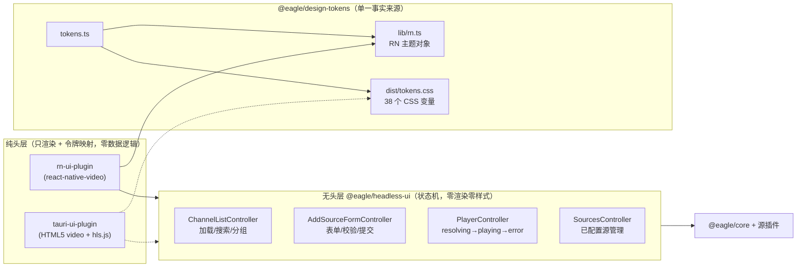
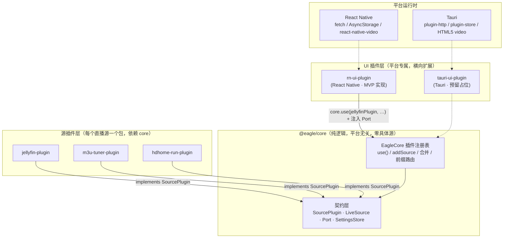

# Eagle — Jellyfin 电视直播 App（MVP）技术方案

> 基于 React Native 与 Cordis 式"核心逻辑 + 源插件 + **无头层/纯头层** + 设计令牌"分层架构的多源电视直播客户端。
> **状态：MVP 已落地**——1 核心 + 3 源插件 + 1 无头层 + 1 设计令牌包 + 1 React Native 纯头 + 1 Tauri 预留，43 个单测全绿。

---

## 0. 无头层 / 纯头层（headless + headed）架构

在源插件化之上再做一次正交切分——**行为与视觉分离**：



| 层 | 职责 | 禁止 |
|---|---|---|
| 无头层 | 状态机、转换、派生选择器（`groups()`/`visibleChannels()`）、跨控制器联动 | import react-native / DOM / 任何样式 |
| 设计令牌 | 颜色/间距/圆角/字重的唯一事实来源，代码生成双端产物 | 手写十六进制值出现在屏幕代码中 |
| 纯头层 | 订阅控制器状态并渲染；把播放器事件转发回控制器 | 数据获取、过滤、表单校验等任何业务逻辑 |

**设计一致性的保证方式是"构造"而非"纪律"**：RN 头 import `@eagle/design-tokens/rn`，
Tauri 头 import `@eagle/design-tokens/css`——两份产物由同一个 `build.mjs` 从同一 `tokens.ts`
生成，不可能漂移。表单结构也走同一思路：`plugin.formFields` 是声明式数据，头部泛化渲染。

---

## 1. 架构设计

### 1.1 分层模块关系



**核心规则（Cordis 理念的落地约束）：**

| 规则 | 落实方式 |
|---|---|
| 核心零平台依赖 | `packages/core/src` 无 `react-native` / `@tauri-apps/*` / DOM / Node 专属 import；HTTP、时钟、哈希、持久化全部抽象为 `Port` / `SettingsStore` |
| **核心零具体源** | core 不 import 任何源包；Jellyfin / M3U Tuner / HDHomeRun 各自成包，**依赖方向：源插件 → core**，经 `core.use(plugin)` 注册 |
| UI 按插件横向扩展 | UI 插件只做三件事：实现 `Port`/`SettingsStore`、组合源插件、绑定播放器 |
| 核心可独立测试 | `MemoryPort` / `MemorySettingsStore` 测试替身；每个包自带 vitest，纯 Node 运行 |

### 1.2 接口定义

**① 源插件契约（源插件 → core 的接入点）** — `packages/core/src/plugin.ts`

```ts
export interface SourcePlugin {
  /** 插件唯一 id：'jellyfin' | 'm3u-tuner' | 'hdhome-run' | … */
  readonly kind: string;
  readonly displayName: string;
  /** 频道 id 前缀（'jf' | 'm3u' | 'hdhr'），EagleCore 按此路由 resolveStream */
  readonly channelIdPrefix: string;
  /** 校验输入、登录/发现设备，返回可持久化的连接状态 */
  connect(port: Port, input: PluginConfig): Promise<PluginConnection>;
  /** 从持久化状态重建 LiveSource（启动恢复） */
  create(port: Port, connection: PluginConnection): LiveSource;
}

export interface PluginConnection {
  id: string;          // 稳定实例 id（内容哈希派生）
  label: string;       // 设置页显示名
  state: PluginConfig; // 插件私有 opaque 状态（session / playlistUrl / device）
}
```

**② 能力注入接口（UI 插件 → core）** — `packages/core/src/types.ts`

```ts
export interface Port {
  getText(url: string, init?: HttpInit): Promise<string>;                // M3U
  getJson<T>(url: string, init?: HttpInit): Promise<T>;                  // Jellyfin / HDHomeRun
  postJson?<T>(url: string, body: unknown, init?: HttpInit): Promise<T>; // Jellyfin 登录
  now(): number;
  hash(input: string): string;
}

export interface SettingsStore {
  get<T>(key: string): Promise<T | undefined>;
  set<T>(key: string, value: T): Promise<void>;
  remove(key: string): Promise<void>;
}
```

**③ 直播源接口（core 内部扩展点）** — `packages/core/src/source.ts`

```ts
export interface LiveSource {
  readonly kind: SourceKind;
  readonly sourceId: string;
  listChannels(opts?: ListChannelsOpts): Promise<ChannelPage>;
  resolveStream(channelId: string): Promise<StreamUrl>;
  searchChannels?(query: string): Promise<Channel[]>;
}
```

**④ 编排门面（UI 插件 ← core）** — `packages/core/src/eagle.ts`

```ts
export class EagleCore {
  use(plugin: SourcePlugin): this;                    // 注册源插件
  listPlugins(): SourcePlugin[];                      // 设置页据此渲染"添加源"表单
  hydrate(): Promise<void>;                           // 恢复已配置源（经 plugin.create）
  addSource(kind: string, input: PluginConfig): Promise<SourceRef>;  // connect → 持久化 → 挂载
  removeSource(id: string): Promise<void>;
  listSources(): SourceRef[];
  listChannels(): Promise<Channel[]>;                 // 跨源合并，单源失败跳过
  resolveStream(channelId: string): Promise<StreamUrl>;  // 按插件 channelIdPrefix 路由
  invalidateChannels(): void;                         // 下拉刷新
  subscribe(listener: () => void): () => void;
}
```

**⑤ 归一化数据模型：**

```ts
export interface Channel {
  id: string;        // 'jf:<itemId>' | 'm3u:<urlHash>' | 'hdhr:<guideNumber>'
  source: SourceKind;
  name: string;
  logoUrl?: string;
  number?: string;
  group?: string;
}

export interface StreamUrl {
  url: string;
  kind: 'jellyfin-http' | 'jellyfin-hls' | 'm3u' | 'hdhomerun';
  containerHint?: string;
  headers?: Record<string, string>;
}
```

### 1.3 Tauri 插件扩展点（预留）

`packages/tauri-ui-plugin/src/index.ts` 写明四步接入契约：

1. `platform.ts`：`TauriPort`（tauri-plugin-http）+ `SettingsStore`（plugin-store）；
2. `store.ts`：复用 `rn-ui-plugin/src/store.ts`（React 胶水与渲染器无关）；
3. `PlayerScreen`：`react-native-video` → HTML5 `<video>`（hls.js / mux.js）；
4. `App.tsx`：同样的插件组合，导航换 react-router。

---

## 2. 工程目录结构（pnpm monorepo）

```
Eagle/
├── package.json / pnpm-workspace.yaml / lerna.json
├── scripts/eagle.mjs              # 分组任务运行器
└── packages/
    ├── core/                      # @eagle/core —— 契约 + 编排（零具体源）
    │   └── src/
    │       ├── types.ts           # Port / SettingsStore / Channel / StreamUrl / CoreError
    │       ├── source.ts          # LiveSource + LiveSourceBase
    │       ├── plugin.ts          # SourcePlugin 契约（源插件接入点）
    │       ├── eagle.ts           # EagleCore 插件注册表 + 合并/路由/持久化
    │       ├── port-fetch.ts / port-memory.ts / settings-memory.ts
    │       └── eagle.test.ts      # 注册表 8 个单测（fake plugin 泛化验证）
    ├── jellyfin-plugin/           # @eagle/jellyfin-plugin
    │   └── src/{jellyfin.ts, plugin.ts, jellyfin.test.ts}
    ├── m3u-tuner-plugin/          # @eagle/m3u-tuner-plugin
    │   └── src/{m3u-tuner.ts, m3u-tuner.test.ts}
    ├── hdhome-run-plugin/         # @eagle/hdhome-run-plugin
    │   └── src/{hdhome-run.ts, hdhome-run.test.ts}
    ├── rn-ui-plugin/              # @eagle/rn-ui-plugin —— MVP UI 插件
    │   └── src/
    │       ├── platform.ts        # ReactNativePort + AsyncStorage Store
    │       ├── store.ts           # EagleStore（插件经构造函数注入）
    │       ├── ChannelListScreen.tsx / PlayerScreen.tsx
    │       ├── SettingsScreen.tsx # 表单由 listPlugins() 驱动
    │       ├── App.tsx            # MVP_PLUGINS 组合导出
    │       └── index.ts
    └── tauri-ui-plugin/           # @eagle/tauri-ui-plugin —— 预留占位
```

**依赖方向（单向，无环）：**

```
rn-ui-plugin ──► jellyfin-plugin ──► core
rn-ui-plugin ──► m3u-tuner-plugin ──► core
rn-ui-plugin ──► hdhome-run-plugin ──► core
rn-ui-plugin ──────────────────────► core
```

core 不依赖任何包；换掉某个源插件或新增源（如 TVHeadend）完全不触碰 core 与其他插件。

---

## 3. 关键技术选型

| 关注点 | 选型 | 备选与理由 |
|---|---|---|
| **播放器** | `react-native-video` v6 | `expo-av`（直播 ts/m3u8 控制力弱）、`vlc`（体积大、维护差）。原生 ExoPlayer/AVPlayer 对直播容器支持成熟 |
| **状态管理** | 自研 `EagleStore` + `useSyncExternalStore` | Redux/Zustand 无必要；core 本有 `subscribe`，React 18 内置 hook 直接桥接，渲染器无关（Tauri 复用） |
| **网络请求** | 全局 `fetch` 经 `Port` 收窄 | axios 无必要；AbortController 统一超时 |
| **导航** | MVP state 路由（三屏） | `@react-navigation/native-stack` 在 peerDeps 预留，屏幕增多再切 |
| **持久化** | AsyncStorage 经 `SettingsStore` 隔离 | 后续可无痛换 MMKV / Tauri plugin-store |
| **插件注册** | 显式 `core.use(plugin)` 对象注册 | 动态 import/运行时发现（MVP 不需要；显式组合可测、可 tree-shake） |
| **测试** | Vitest（node 环境）+ 各包 alias 指向 core 源码 | Jest 配置重；core 及插件均无 UI 依赖，秒级跑完 |
| **Monorepo** | pnpm workspace + lerna | `workspace:*` 协议 + 每包独立 build/test |

---

## 4. MVP 实施步骤（含验收标准）

| # | 阶段 | 任务 | 验收标准 | 状态 |
|---|---|---|---|---|
| 1 | 骨架 | workspace + 六包占位 + 根脚本 | `pnpm install` 通过；typecheck 全绿 | ✅ |
| 2 | Core 契约 | types/source/plugin：Port、SettingsStore、LiveSource、**SourcePlugin** | 类型编译通过；契约无平台 import | ✅ |
| 3 | Core 注册表 | EagleCore：use/addSource/hydrate/合并/前缀路由 | fake-plugin 单测 8 个全绿（纯 Node） | ✅ |
| 4 | 源插件 ×3 | jellyfin-plugin / m3u-tuner-plugin / hdhome-run-plugin，各自 connect+create | 每包 4–8 个单测全绿；`workspace:*` 依赖方向正确 | ✅ |
| 5 | RN 桥接 | platform.ts + store.ts（插件注入式构造） | typecheck 通过；RN import 集中隔离 | ✅ |
| 6 | RN 屏幕 | 列表/播放/设置三屏；设置页表单由 listPlugins() 驱动 | 三屏闭环；换插件组合无需改屏幕代码 | ✅ |
| 7 | Tauri 预留 | 占位包 + 四步接入契约 | 契约与 rn 插件结构一一对应 | ✅ |
| 8 | 真机联调（下一步） | Expo/RN 壳工程引入 rn-ui-plugin，接真实源 | 真机"登录→列表→播放"全流程 | ⬜ |

---

## 5. 验证记录（本仓库实际执行）

```bash
$ pnpm install                                # 八包依赖安装 ✅
$ pnpm -r typecheck                           # 8/8 包全绿 ✅
$ pnpm --filter '@eagle/*' run test           # 43 用例全绿 ✅
#   core 8 · headless-ui 19 · jellyfin 4 · m3u-tuner 8 · hdhome-run 4
$ pnpm --filter @eagle/design-tokens build    # 生成 RN 主题 + 38 个 CSS 变量 ✅
```

覆盖场景：插件注册/未知 kind 拒绝/持久化恢复/未注册插件跳过/多源合并与故障隔离/订阅通知/前缀路由；Jellyfin 登录与频道归一化；M3U 解析容错（无逗号/裸 URL/去重/TTL 缓存）；HDHomeRun 发现/lineup/直连播放/DeviceID 派生 id。

## 5.1 快速打包（packages/rn-app Expo 壳）

monorepo Metro 已配好（`packages/rn-app/metro.config.js`：workspace watchFolders + pnpm 符号链接 +
`.js→.ts` 源码桥接；各包 `react-native` 字段直指 TS 源码，**改包无需预构建**）。

| 场景 | 命令 | 耗时 |
|---|---|---|
| 本地开发（热更新） | `pnpm --filter @eagle/mobile start` | 秒级 |
| JS 产物冒烟（CI 可跑，无需 SDK） | `pnpm --filter @eagle/mobile build:js` | ~40s |
| 本地 Android APK（需 Android SDK） | `pnpm --filter @eagle/mobile android` | 首次约 5–10 分钟 |
| 本地 iOS（需 macOS + Xcode） | `pnpm --filter @eagle/mobile ios` | 首次约 5–10 分钟 |
| 云端打包 APK（EAS，免本地 SDK） | `pnpm --filter @eagle/mobile apk` | 排队 + 约 10 分钟 |
| 云端 iOS 模拟器包（EAS） | `pnpm --filter @eagle/mobile ipa` | 同上 |

要点：
- **最快出包路径**：`eas build -p android --profile preview`（`eas.json` 已配 APK + internal
  分发），本地零 Android SDK，产物扫码安装。
- `app.json` 已开 `usesCleartextTraffic`（Android）/ `NSAllowsArbitraryLoads`（iOS）——直播源
  常是局域网 HTTP 明文流。
- JS 产物冒烟已验证：`expo export --platform android` 成功产出 bundle，覆盖 core + 三源插件 +
  headless-ui + design-tokens 完整依赖图。

## 6. 环境说明

沙箱全局 pnpm 不可用，pnpm 10.34.5 已解包至 `tools/`（gitignore）。运行：
`node tools/package/bin/pnpm.cjs <cmd>`，首次 install 需 `PNPM_HOME`/`XDG_DATA_HOME` 重定向到 `tools/` 下（详见 `docs/dev.md`）。
